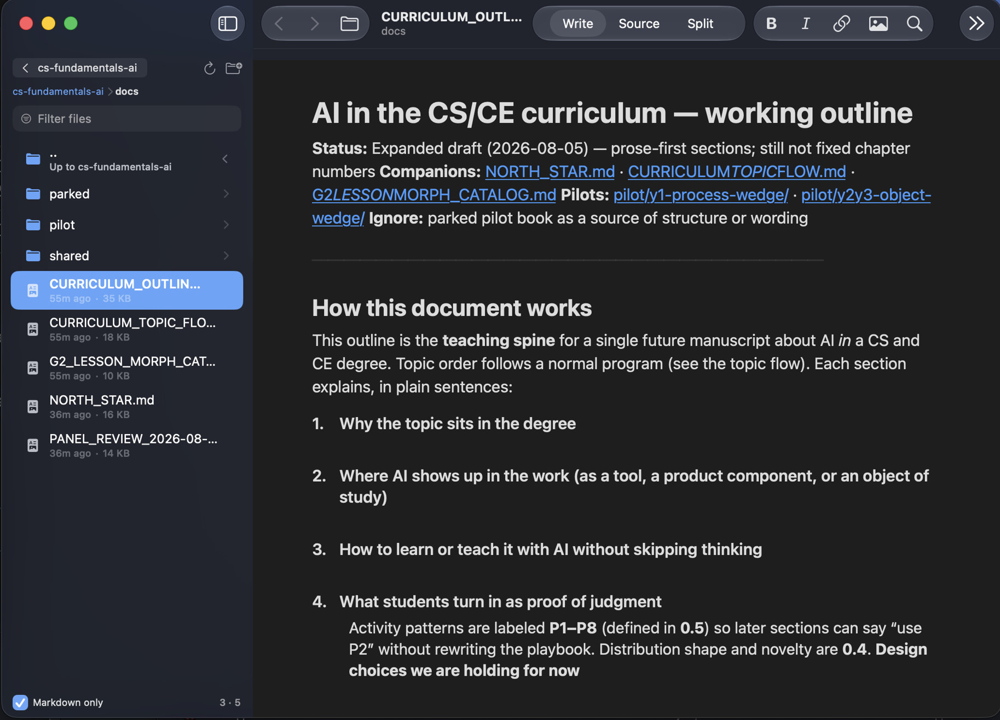

# Markdowner

**Version 1.1.1** — native **macOS 26+** WYSIWYG Markdown word processor. Write like a document app; files stay portable `.md`. Browse folders of notes—or a **read-only `.zip` package**—from a Finder-style sidebar.



## Features

- **File sidebar** — folders + Markdown; optional filter; live refresh; `.zip` packages listed and openable
- **True WYSIWYG editing** — headings, bold, italic, lists, quotes, code, links, tables, task lists (`NSTextView`)
- **Images** — show in Write/Preview; drag & drop, paste, or **⇧⌘I** (prefer `assets/`; data URL fallback); right-click Save/Copy
- **Write / Source / Split** — word processor, raw Markdown, or both; optional **content-based** scroll sync (off by default)
- **Links** — `.md` in-app (or new window); directories → sidebar only; web/HTML → browser; multi-segment relative paths; same-doc `#anchors`
- **Find & Replace** — **⌘F** / **⌥⌘F**
- **Export** — HTML / PDF
- **Multi-window** — independent workspaces; document back/forward for `.md` links
- **Read-only packages** — open a zip of Markdown + assets as a tree; banner + no save; **Extract…** to edit on disk
- **Build Info** — every binary embeds compile date/time (**Markdowner → Build Info…**)

## Documentation

| Doc | Contents |
|-----|----------|
| **[docs/ARCHITECTURE.md](docs/ARCHITECTURE.md)** | Data flow, dual Markdown pipelines, packages, modules |
| **[docs/MARKDOWN.md](docs/MARKDOWN.md)** | Supported syntax, round-trip, limitations |
| **[docs/PACKAGES.md](docs/PACKAGES.md)** | Zip packages (read-only), extract workflow, sample |
| **[docs/DISTRIBUTION.md](docs/DISTRIBUTION.md)** | Code ready → Mac App Store listing → charging $2.99 |
| **[CHANGELOG.md](CHANGELOG.md)** | Release notes |
| This README | Features, build, DMG, shortcuts |

### Which build am I running?

- **Markdowner → Build Info…** or **Help → Build Info…**
- Shows marketing version, build number, Debug/Release, timestamp, compact stamp, and bundle path

## Requirements

- **macOS 26** or later  
- Xcode 26+ (to build from source)

## Install (DMG)

1. Open `releases/Markdowner-1.1.1.dmg` (or build one below).
2. Drag **Markdowner** to **Applications**.
3. First launch on another Mac may need **right-click → Open** (ad-hoc signed, not notarized).

## Build & run

```bash
open Markdowner.xcodeproj
# ⌘R in Xcode
```

```bash
xcodebuild -scheme Markdowner -configuration Debug -derivedDataPath build CODE_SIGN_IDENTITY="-" build
open build/Build/Products/Debug/Markdowner.app
```

## Package a DMG

```bash
./scripts/package-dmg.sh
```

Produces:

- `dist/Markdowner-1.1.1.dmg` (and `dist/Markdowner.dmg`)
- Copy shipped for the repo: `releases/Markdowner-1.1.1.dmg`
- Release app: `build/Build/Products/Release/Markdowner.app`

Ad-hoc signed only. For public distribution: Developer ID + `notarytool`.

## How it works (quick)

SwiftUI **WindowGroup** workspace (not `DocumentGroup`):

```
Open .md  →  WorkspaceModel.text
                 │
     ┌───────────┼───────────┐
     ▼           ▼           ▼
  Write       Source       Split
  rich        raw MD       source + preview
     │
  save UTF-8 .md   (disabled inside zip packages)
```

- **Write** — `MarkdownRichText` ↔ `NSAttributedString`
- **Preview / Split** — `MarkdownBlockParser` + SwiftUI
- **Packages** — zip expanded to a private cache; sidebar + links use that tree; **read-only**
- **PDF** — temporary `WKWebView` (export only)

Details: [docs/ARCHITECTURE.md](docs/ARCHITECTURE.md) · [docs/PACKAGES.md](docs/PACKAGES.md)

## Folder sidebar & packages

1. **⌥⌘O** — open a folder  
   **⇧⌥⌘O** / zip toolbar icon — **Open Package…** (`.zip`)  
   Or click a **`.zip`** in the sidebar (always listed, even with the type filter on)
2. Click `.md` to open; folders drill down; **⌘↑** goes up
3. Breadcrumbs jump within the root (folder or package)
4. Last **folder** is remembered (bookmark); packages are session-only
5. Directory links navigate the **sidebar only** (not document history)

### Zip packages (read-only)

See **[docs/PACKAGES.md](docs/PACKAGES.md)**. Sample archive:

`docs/samples/sample-curriculum-package.zip`

| Sidebar action     | Shortcut / control        |
|--------------------|---------------------------|
| Toggle sidebar     | ⌥⌘S                       |
| Open folder        | ⌥⌘O                       |
| Open package       | ⇧⌥⌘O                      |
| Parent folder      | ⌘↑ / ←                    |
| Open selection     | Return / → on folders     |
| Type filter        | Footer: Folders+MD+Zips   |

## Shortcuts

| Action              | Shortcut     |
|---------------------|--------------|
| New document        | ⌘N           |
| New window          | ⌘⇧N          |
| Open file           | ⌘O           |
| Open folder         | ⌥⌘O          |
| Open package        | ⇧⌥⌘O         |
| Open current in new window | ⌘⇧D   |
| Save / Save As      | ⌘S / ⌘⇧S     |
| Document back/fwd   | ⌘[ / ⌘]      |
| Bold / Italic       | ⌘B / ⌘I      |
| Strikethrough       | ⌘⇧X          |
| Link                | ⌘K           |
| Insert image        | ⇧⌘I          |
| Inline code         | ⌘⇧E          |
| Heading 1–3         | ⌥⌘1 / 2 / 3  |
| Bullet / numbered   | ⌘⇧8 / ⌘⇧7    |
| Quote               | ⌘⇧'          |
| Source / Split      | ⌘\\ / ⌥⌘\\   |
| Find / Replace      | ⌘F / ⌥⌘F     |
| Find next/prev      | ⌘G / ⇧⌘G     |
| Toggle sidebar      | ⌥⌘S          |

Split **Sync scroll** is off by default; when on, panes align by **text fingerprint** (not equal pixel rates).

## View modes

| Mode | Description |
|------|-------------|
| **Write** | WYSIWYG (`NSTextView`) |
| **Source** | Raw Markdown |
| **Split** | Source + preview; optional sync |

## Project layout

```
Markdowner/
  MarkdownerApp.swift, EditorContainerView.swift, NativeEditorView.swift
  MarkdownRichText.swift, MarkdownDocumentView.swift, MarkdownInline.swift
  LinkHandling.swift, WorkspaceModel.swift
  FolderBrowser.swift, FileSidebarView.swift, ZipPackageService.swift
  ExportService.swift, FindReplaceBar.swift, BuildInfo.swift (generated)
docs/
  ARCHITECTURE.md, MARKDOWN.md, PACKAGES.md
  samples/sample-curriculum-package.zip
  images/screenshot.jpg
scripts/
  package-dmg.sh, generate-build-info.sh
releases/
  Markdowner-1.1.1.dmg
```

## License

MIT — see [LICENSE](LICENSE).
