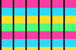

# Phase 1–2 test document

Use this file to verify **images**, **tasks**, **nested lists**, and **code highlighting**.

Open folder: `docs/samples/phase12-test` · open this file · use **Write** mode.

---

## Images (Phase 1)

### Relative file (should display)


Tiny / striped asset (should be loud pink–cyan–yellow bands — hard to miss on dark mode):



Also as `stripes.png`:


### Inline with text

Before image  after image — Write may put the image on its own visual run; Preview stacks segments.

### Checklist for you

- [ ] Relative images show in **Write**
- [ ] Relative images show in **Split → Preview**
- [ ] Right-click image → **Save Image…** / **Copy Image** / **Copy Markdown**
- [ ] Drag a PNG from Finder into Write (saves under `assets/` if doc is saved)
- [ ] Paste a screenshot into Write
- [ ] Insert Image… (toolbar photo button) works
- [ ] Export HTML/PDF still includes images

---

## Task lists (Phase 2)

- [ ] Unchecked item — **click the box in Write** to toggle
- [x] Already checked — click to uncheck
- [ ] Another open task

---

## Nested lists (Phase 2)

- Parent A
  - Child A1
  - Child A2
    - Grandchild A2a
- Parent B
  - Child B1

1. First
   1. Nested one
   2. Nested two
2. Second

---

## Code (Phase 2 — light highlight)

```swift
func greet(name: String) -> String {
    // comment
    let message = "Hello, \(name)"
    return message
}
```

```python
def add(a, b):
    # sum
    return a + b
```

```json
{ "ok": true, "count": 3 }
```

---

## Tables (regression)

| Feature | Write | Preview |
|---------|-------|---------|
| Text | yes | yes |
| Tables | yes | yes |
| Images | **test** | **test** |

---

## Prose + emphasis

**Bold**, *italic*, ~~strike~~, `inline code`, and a [relative link](TEST.md#images-phase-1).

Web: [example.com](https://example.com)

---

*End of test doc — leave this file dirty only if you are trying save prompts.*
